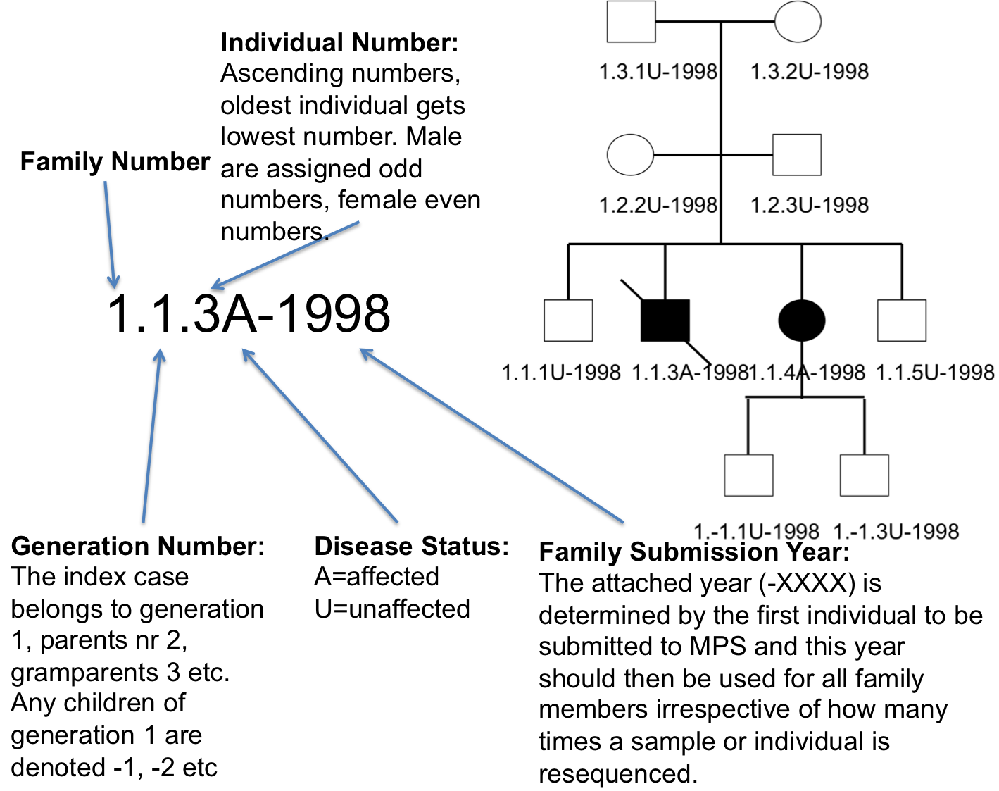

Individual Identification Number (IDN)
======================================

Ensure that each individual are anonymized and unique. The IDN also facilitates tracking 
of all operations and analyses performed upon the individual.

.. note::
 Changes to the IDN format should be recorded in this document.

IDN Definition
-------------- 
The IDN consists of a three digits connected by dots and a disease status (DS) letter after the last digit. The disease status letter can be either an “A” denoting affected subjects or a “U” denoting unaffected subjects. Connected to the disease status letter with a dash is the year (4 digits (at least for a very long time)) that the first individual of the family was submitted to massively parallel sequencing, MPS. Each subject can only have 1 IDN and once set it should never be changed.

- The first digit represents the family identification number (FamilyID/FDN). 
- The second digit represents the generation identification number (GenerationID/GDN) within that family. The generation with the affected child is the defined as GDN = 1. Older generation are numbered in ascending order from GDN 1, starting with 2. Younger generations are numbered in descending order from GDN 1 starting with -1. 
- The last digit represents the subject identification number (SubjectID/SDN) within the family and generation. Male subjects will have odd SDN numbers and female subjects even numbers. The lowest subject IDs will be given to oldest subject within each family and generation and then in ascending order (both even and odd numbers are counted). However, since there can be later additions in the pedigree this is not strictly enforced.
- The letter after the SDN is the disease status (DS) letter, which can be either of two possible letters. A = affected and U = unaffected.
- The attached year (-XXXX) is determined by the first individual to be submitted to MPS and this year should then be used for all family members irrespective of how many times a sample or individual is resequenced. This rule is enforced to not create multiple IDNs for the same individual and to make sure that all family members are grouped and analyzed in the proper family.  

Example
~~~~~~~
FamilyID.GenerationID.SubjectID(DS)-Year or FDN.GDN.SDN(DS)-Year

A child in the affected child generation being the second oldest male sibling in family 1 and the first to be submitted to sequencing within the family in 1998 would be written as: 1.1.3A-1998 (Figure 1). 

