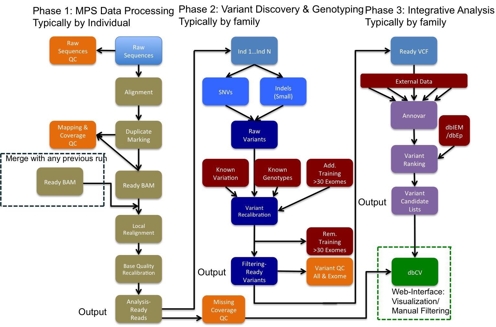

MIP - Mutation Identification Pipeline
======================================
MIP enables identification of potential disease causing variants from sequencing
data.

Overview
--------
MIP performs whole genome or target region analysis of sequenced paired end
reads from the Illumina plattform in fastq(.gz) format to generate annotated
ranked potential disease causing variants. 
MIP performs QC, alignment, variant discovery and
annotation as well as ranking the found variants according to disease potential
with a minimum of manual intervention.

Example Usage
-------------
``perl mip.pl -pMosaikBuild 0 -configFile 1_config.yaml``

Getting Started
---------------

Installation
~~~~~~~~~~~~
MIP is written in Perl and therfore requires that Perl is installed on your OS (See :doc:`installation`).

Prerequisites
~~~~~~~~~~~~~~
.. todo::

  Mention something about SLURM dependency

MIP will only require prerequisites when processing a modules that has dependencies (See :doc:`setup`).

Meta-Data
^^^^^^^^^^
- Pedigree file (`PLINK`_-format; See :doc:`pedigree_file`)
- Master template files for intersectCollect.pl (See :doc:`intersectCollect`).

Usage
~~~~~
MIP is called from the command line and takes input from the command line
(precedence), a config file (yaml-format) or falls back on defaults where applicable.

Lists are supplied as comma separated input or repeated flag entries. Only flags
that will actually be used needs to be specified and MIP will check that all
required parameters and dependencies (for these flags only) are set before submitting to SLURM. 

Program parameters always begins with "p". Program parameters can be set to "0"
(=off), "1" (=on) and "2" (=dry run mode). Any program can be set to dry
run mode and MIP will create sbatch scripts, but not submit them to SLURM for these modules. MIP
can be restarted from any module, but you need to supply previous dependent
programs in dry run mode to ensure proper file handling. 

MIP will overwrite data files when reanalyzing, but keeps all "versioned" sbatch scripts for traceability.

MIP allows individual target file calculations if supplied with a pedigree file
containing the supported capture kits.

You can always supply ``perl mip.pl -h`` to list all available parameters and
defaults.

**Example usage:**

.. code-block:: console

  $ perl mip.pl -f 3 -sampleid 3-1-1A,3-2-1U -sampleid 3-2-2U -pFQC 0 -pMosaikBuild 2 -pMosaikAlign 2 -c 3_config.yaml

This will analyze *family 3* using *three individuals* from that family and begin the
analysis with programs *after MosaikAlign* and use all parameter values as
specified in the *config file*, except those supplied on the command line, which
has precedence.

**Input**

MIP requires the input Fastq files to follow a naming convention to accurately and automatically handel individual runs and lanes (See :doc:`setup`). 

Fastq files (gziped/uncompressed) should be place within the ``-inFilesDirs``. 

.. note::

  MIP will automatically compress any non gzipped files if ``-pGZip`` is enabled. 
  All files ending with .fastq or .fast.gz will be included in the run.

All MIP scripts (including mip.pl) should be placed in the script directory
specified by ``-inScriptDir``.

All references and template files should be placed directly in the reference
directory specified by ``-referencesDir``, except for ANNOVAR db files, which
should be located in *annovar/humandb*.

**Output**

Analyses done per individual is found under respective sampleID subdirectory and analyses done including all samples can be found under the family directory.

**Sbatch Scripts**

MIP will create sbatch scripts (.sh) and submit them in proper order with
attached dependencies to SLURM. These sbatch script are placed in the output
script directory specified by ``-outScriptDir``. The sbatch scripts are versioned
and will not be overwritten if you begin a new analysis.

**Data**

MIP will place any generated datafiles in the output data directory specified by
``-outDataDir``. All datatfiles are regenerated for each analysis. *STDOUT* and
*STDERR* for each program is written in the *<program>/info* directory prior to
alignment and in the *<aligner>/info* directory post alignment.

**Analysis Types**

Currently, MIP handles WES ``-at exomes``, WGS ``-at genomes`` or Rapid analysis ``-at rapid`` for acute patient(s). 
The rapid analysis requires ``BWA_MEM`` and selects the data that overlaps with the regions supplied with 
the ``-bwamemrdb`` flag. 

.. note::

   In rapid mode; Sort and index is done for each batch of reads in the ``BWA_Mem`` call, since the link to infile is broken by the read batch processing. However ``pSamToolsSort`` should be enabled to ensure correct fileending and merge the flow to ordinary modules.

**Project ID**

The ``-projectID`` flag sets the account to which core hours will be allocated in SLURM.

**Aligner**

Currently MIP officially supports two aligners `Mosaik`_ and `BWA`_, but technically supports any aligner that outputs BAM files. 
Follow the instructions in :doc:`adding-new-programs` to add your own favorite aligner.

**Pipeline WorkFlow**

This is an example of a workflow that MIP can perform (used @CMMS).

.. csv-table:: MIP Parameters
  :header-rows: 1
  :widths: 2, 1, 1, 3
  :file: MIP_parameters.csv

\* outDataDir/familyID/aligner/GATK/candidates/ranking/familyID_orphan.selectVariants, outDataDir/familyID/aligner/GATK/candidates/ranking/clinical/familyID.selectVariants

.. _PLINK: http://pngu.mgh.harvard.edu/~purcell/plink/data.shtml
.. _Mosaik: https://github.com/wanpinglee/MOSAIK
.. _BWA: http://bio-bwa.sourceforge.net/