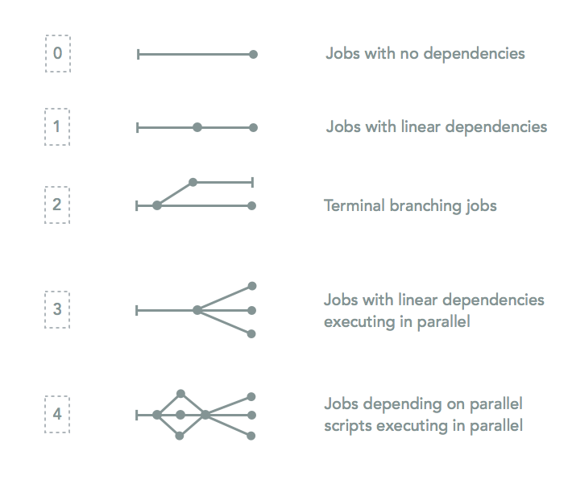

Adding a new program
=====================

You need to perform a series of tasks to properly add a program to MIP. An overview of the steps can be found here:

1. :ref:`define-parameters`

2. :ref:`get-options`

3. :ref:`if-block`

  a. Print program name to the MIPLOGG + STDOUT
  b. Call your custom subroutine (ses below) with relevant parameters

4. :ref:`custom-sub`

  a. Writes SBATCH headers
  b. Figure out i/o files
  c. Builds out the body of the SBATCH script
  d. Calls FIDsubmit

More details follow below. `chanjo, a program which is part of the coverage analysis, will be used as an example throught this guide.

.. _define-parameters:

Call DefineParameters
-------------------------
This subroutine takes a number of input parameters. There are basically three parameter types: "program", "file", and "attribute".

.. csv-table:: DefineParameters - paramaters
  :header: "Parameter", "Example", "Description"
  :widths: 1, 2, 3

  "Name", "pChanjo", "Program names start with `p` by convention, otherwise it's up to you."
  "Type", "program", "Can be either `program` or `path`."
  "Default", 1, "**program**: 1/0 as on/off, **file**: path to file or `nodefault`, **attribute**: e.g 10 or `nodefault`"
  "Uppmax default", 1, "See `Default`."
  "Associated program", "MIP", "Typically the program that calls this program. **program**: usually `MIP`, **file/attribute**: `<Name>`."
  "Exists check", 0, "Perform a check that a file is in the reference directory. **program/attribute**: 0, **file**: 0/1."
  "File ending", "nofileEnding", "File ending when module is finished. MIP uses this to determine input files downstream in the `Chain`. **file/attribute**: skip."
  "Chain", "MAIN", "The chain to which the program belongs to. **file/attribute**: skip."

.. note::

  A 10th parameter will be added and represent the actual program handle which is used to check if the program is installed before running MIP.

.. _get-options:

Add command line arguments to `GetOptions`
----------------------------------------------
This is the method that parses the command line input and stores the options. To add your own defined parameters you need to add lines like this::

  '<short_option>|<long_option>:<s(tring)/n(umber)>' => \$parameter{'<long_option>'}{'value'},

You should replace anything that looks like ``<placeholder>``::

  'pCh|pChanjo:n' => \$parameter{'pChanjo'}{'value'},

Again, program options begin with a leading "p" by convention. Make sure you don't cause any naming conflicts.

.. note::

  MIP doesn't use True/False flags so you should always specify a following argument. This makes it possible to turned on (1), off (0) and run programs in dry mode (2). All program options should specify "n(umber)" as option type.

.. _if-block:

if-block run checker
---------------------
The if-block has a number of uses. First it should check whether the program has been set to run::

  if ($scriptParameter{'pChanjo'} > 0) {
    # Body...
  }

Next (inside if-block) it should print an announcement to 2 file handles::

  my announcemnet = "\nChanjo\n"  # Keeping it dry :)
  print STDOUT announcemnet; print MIPLOGG announcemnet;

Lastly it should call the custom subroutine, e.g. for each individual sample::

  foreach my $sampleID (@sampleIDs) {
    chanjo(
      $sampleID,
      $scriptParameter{'familyID'},
      $scriptParameter{'chanjoStore'}
    );
  }

.. _custom-sub:

Custom subroutine
------------------
To keep `mip.pl` clean it's helpful to write the custom subroutine as a separate Perl file and subsequently "require" it into `mip.pl`.

First up, let's choose a relevant (and conflict free) name for our subroutine::

  sub chanjo {
    # Body...
  }

We should pass ALL nessesary variables into the subroutine and assign them as scoped variables::

  my $sampleID = $_[0];
  my $familyID = $_[1];
  my $aligner = $_[2];
  ...

SBATCH headers
~~~~~~~~~~~~~~~~
SBATCH headers are written by the `ProgramPreRequisites` subroutine. It takes a number of input arguments listed here:

.. csv-table:: ProgramPreRequisites - paramaters
  :header: "Parameter", "Example", "Description"
  :widths: 1, 2, 3

  "Directory", "11-1-1A", "Either a sample ID (e.g. IDN) or family ID depending on where output is stored."
  "Program", "chanjo", "Used in SBATCH script filename."
  "Program directory", "``$aligner/coverageReport``", "Defines output directory under `Directory`. Path should include current aligner by convention."
  "Call type", 0, "Options: `SNV`, `INDEL` or `BOTH`. Can be set to: 0 ???"
  "File handle", ``*CHANJO``, "The program specific file handle which will be written to when generating the SBATCH script. Always prepend: `*`."
  "Cores", 1, "The number of cores to allocate."
  "Process time", 1.5, "An estimate of the runtime for the particular sample in hours."

Figure out i/o files
~~~~~~~~~~~~~~~~~~~~~
It's up to you to figure out where your program stores it's output files. Basically you need to figure out if it makes more sense to add them to either the family or in each sample folder.

It's a good idea to first specify both in- and output directories like so::

  my $baseDir = "$outDataDir/$sampleID/$aligner";
  my $inDir = $baseDir;
  my $outDir = "$baseDir/coverageReport";

If you depend on earlier scripts to generater infile for the new program it's up to you to figure out the program upstream. After that you can ask for the file ending like so::

  my $infileEnding = $sampleInfo{ $familyID }{ $sampleID }{'pPicardToolsMarkduplicates'}{'fileEnding'};

``$sampleInfo`` is a hash table in the global scope. [HENRIK EXPLAINS SWITCH]::

  my ($infile, $mergeSwitch) = CheckIfMergedFiles($sampleID);

Build SBATCH body
~~~~~~~~~~~~~~~~~~
This step is pretty much up to you. You simply do what you have to in order to print out what's required for running the program to the file handle you defined in "4a"::

  print CHANJO "
  # ------------------------------------------------------------
  #  Create a temp JSON file with exon coverage annotations
  # ------------------------------------------------------------\n";
  print CHANJO "chanjo annotate $storePath using $bamFile";
  print CHANJO "--cutoff $cutoff";
  print CHANJO "--sample $sampleID";
  print CHANJO "--group $familyID";
  print CHANJO "--json $jsonPath";

.. note::

  A ``wait`` command should be added after submitting multiple processes in the same SBATCH script with the ``&`` command. This will ensure SLURM waits for all processes to finish before quitting on the job.

Call `FIDSubmitJob`
~~~~~~~~~~~~~~~~~~~~
This subroutine is responsible for actually submitting the SBATCH script and handling dependencies. You should only call this if the program is supposed to run for real (not dry run)::

  if ( ($runMode == 1) && ($dryRunAll == 0) ) {
    # Chanjo is a terminally branching job: linear dependencies/no follow up
    FIDSubmitJob($sampleID, $familyID, 2, $parameter{'pChanjo'}{'chain'}, $filename, 0);
  }

To figure out which option (integer) to supply as the third argument to `FIDSubmitJob` you can take a look at this illustration.

Further information
--------------------
For your convinience a template program module can be found in the project folder hosted on GitHub. [ADD LINK TO TEMPLATE]
