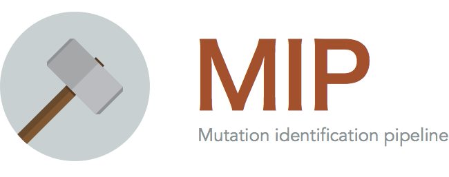

.. MIP_api documentation master file, created by
   sphinx-quickstart on Wed Sep  4 10:33:34 2013.
   You can adapt this file completely to your liking, but it should at least
   contain the root `toctree` directive.

Release |version|.

`MIP <https://github.com/henrikstranneheim/MIP>`_ is a pipeline for clinical analysis of whole exome and whole genome data.
Here will follow a documentation of the different file formats, and also maybe the steps of the pipeline.

Contents:

.. toctree::
   :maxdepth: 2
   
   MIP_overview
   installation
   setup
   adding-new-programs
   structure
   intersectCollect
   annotated_file
   pedigree_file
   IDN

Indices and tables
==================

* :ref:`genindex`
* :ref:`modindex`
* :ref:`search`

